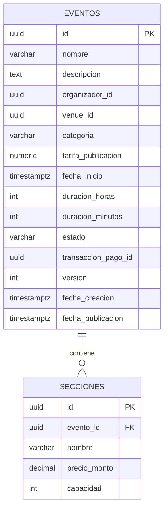

# Arquitectura: Events Service

Este documento describe la arquitectura del `events-service`, que se basa en los principios de **Arquitectura Hexagonal** y **Domain-Driven Design (DDD)** definidos en la [guía técnica central](https://eventmesh-lab.github.io/org-docs/guia-tecnica/).

## 1. Estructura de Proyectos (Capas)

La solución está organizada en cuatro proyectos principales, cada uno representando una capa lógica con responsabilidades claras:

### `events-service.Domain`

Es el núcleo de la aplicación. Contiene la lógica y las reglas de negocio más importantes, sin depender de ninguna tecnología externa.

- **Agregados:** `Evento` es el aggregate root, responsable de mantener sus invariantes.
- **Entidades:** `Seccion`.
- **Value Objects:** `FechaEvento`, `DuracionEvento`, `EstadoEvento`, `PrecioEntrada`.
- **Eventos de Dominio:** `EventoCreado`, `EventoPublicado`, etc.
- **Interfaces de Repositorio (Puertos):** Define los contratos para la persistencia (ej. `IEventoRepository`), que serán implementados por la capa de infraestructura.

### `events-service.Application`

Orquesta los casos de uso y no contiene lógica de negocio. Actúa como un intermediario entre la capa de presentación/API y el dominio.

- **Patrón CQRS:** Utiliza `MediatR` para separar los comandos (escrituras) de las consultas (lecturas).
- **Comandos:** `CrearEventoCommand`, `PublicarEventoCommand`, etc. Cada comando encapsula una solicitud para modificar el estado del sistema.
- **Handlers:** `CrearEventoCommandHandler` contiene la lógica para orquestar la ejecución de un comando: recupera el agregado, invoca sus métodos de negocio y persiste los cambios.
- **Validaciones:** Usa `FluentValidation` para validar los datos de entrada de los comandos antes de que lleguen al dominio.

### `events-service.Infrastructure`

Implementa los "adaptadores" para las tecnologías externas. Es el pegamento entre el núcleo de la aplicación y el mundo exterior.

- **Persistencia:** Implementa los repositorios definidos en el dominio utilizando **Entity Framework Core** con PostgreSQL.
- **Mensajería:** Publica eventos de dominio en un bus de mensajes (**RabbitMQ**) para la comunicación asíncrona con otros microservicios.
- **Servicios Externos:** Contiene clientes para interactuar con otras APIs si fuera necesario.

### `events-service.Api`

Es el punto de entrada a la aplicación. Expone la funcionalidad a través de una API REST.

- **Endpoints:** Se implementan utilizando **.NET 8 Minimal APIs**.
- **Responsabilidad:** Recibe peticiones HTTP, las traduce a comandos o consultas de MediatR, y las envía a la capa de aplicación. Devuelve las respuestas al cliente.
- **Configuración:** Gestiona la configuración de la aplicación, el registro de dependencias (IoC), y el pipeline de middleware.

## 2. Flujo de un Comando (Ej: `CrearEvento`)

1. **API Layer (`Program.cs`):** Un endpoint `POST /api/eventos` recibe la petición HTTP.
2. **Mapeo:** El cuerpo de la petición se mapea a un `CrearEventoCommand`.
3. **Application Layer (`MediatR`):** El comando es enviado a través de MediatR a su manejador (`CrearEventoCommandHandler`).
4. **Validación:** El handler primero valida el comando.
5. **Domain Layer:**
    - El handler invoca un método factoría o el constructor del agregado `Evento` para crear una nueva instancia.
    - El agregado `Evento` valida las reglas de negocio (invariantes) y, si todo es correcto, genera un evento de dominio `EventoCreado`.
6. **Infrastructure Layer:**
    - El handler utiliza el `IEventoRepository` para persistir el nuevo evento en la base de datos.
    - Publica el evento de dominio `EventoCreado` en RabbitMQ.
7. **API Layer:** El endpoint devuelve una respuesta `201 Created`.

## 3. Modelo relacional (PostgreSQL)

El esquema en PostgreSQL se limita al agregado `Evento` y su entidad `Seccion`. La siguiente vista ER resume las tablas, columnas principales y cardinalidades tal como las define la capa de infraestructura (`EventsDbContext` y las configuraciones Fluent API).

